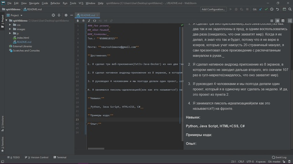

### _Мое резюме_

## _Адам Моитов_

### _Контакты:_

Тел.: **0500010315**

Почта: **neuroshimaone@gmail.com**

**Достижения:**

1. Я сделал три веб-приложения(ExtJs-Java-Docker) из них два так и не задеплоены в прод, а одним воспользовались два раза.(ожидалось, что они захватят мир). Когда я их делал, я знал что так и будет, потому что я не верю в юзеров, которые учат наизусть 20-страничный мануал, я сам презентовал свое произведение с распечатанным мануалом в руках._

2. Я сделал нативное андроид-приложение из 8 экранов, в котором никто не заходил дальше второго, его скачали 107 раз в гугл-маркете(ожидалось, что оно захватит мир).

3. Я руководил 4 человеками и мы полгода делали один проект, который я в одиночку мог сделать за неделю. И да, это проект из пункта 2.

4. Я занимался пиксель-идеализацией(или как это называется?) на фронте.

**Навыки:**

__Python, Java Script, HTML+CSS, C#__

**Примеры кода:**

**Опыт:**

1. 2015-2022 гг. Интернет магазин компьютерной техники. Программист.

    * Системное администрирование корпоративной сети.
    * Установка и обслуживание программного обеспечения.
    * Создание профилей работников компании.
    * Установка и обновление необходимых программ.
2. 2018-2018 гг. Официант в ресторане "Black Code"
3. 2018-2021 гг. Фриланс. Разработка приложений для андроид.

**Образование:**

1. 2003-2005 гг. Высокий детский сад технологий.
2. 2005-2015 гг. Высокая школа технологий.
3. 2015-2020 гг. Высокий университет технологий.